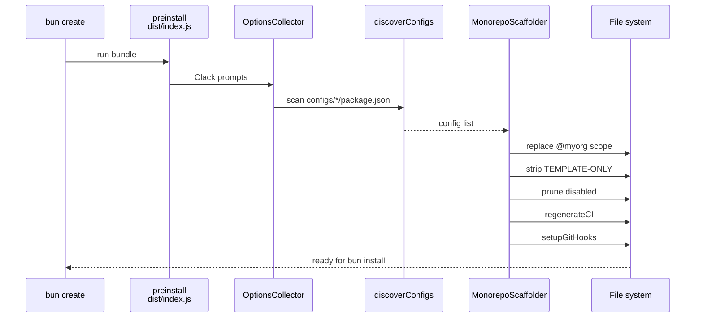

## Scaffolding (Template Development Only)

> [!IMPORTANT]
> `configs/template/` is template-only — removed from generated projects (`selfDestruct: true`).

- The `configs/template/` workspace turns this repo into a reusable monorepo template. `bun create Archont561/ts-monorepo-template my-app` runs `bun-create.preinstall` (`bun configs/template/dist/index.js` — the committed bundle), which scaffolds a project (replaces `@myorg` scope, strips `TEMPLATE-ONLY` blocks, removes template-only files, prunes opt-in configs, regenerates workflows from survivors, initializes Git) *before* `bun install`, so only what survives gets installed. Lefthook hooks are installed by the root `prepare` script during that `bun install`. Regular `bun install` in this repo does **not** trigger scaffolding.

- The scaffolder is **data-driven**: `discoverConfigs()` (in `configs/template/src/configs.ts`) scans every `configs/*/package.json` for a `scaffold` metadata field (`default`, `flag`, `prompt`, `type: "confirm" | "select"`, `options`, `removals`, `scriptsToRemove`, `setup`, `selfDestruct`). Configs with `"default": "always"` are always kept — except `selfDestruct` ones (the template itself), which are always removed. No config is hardcoded in the scaffolder.

- After pruning, the scaffolder calls `regenerateCI()` (`.github/workflows/*.yml`) by re-running the discovery-driven aggregation, so a generated project only contains CI steps for the configs that survived. Root `README.md` and `AGENTS.md` are now static reference files (not concatenated) with `TEMPLATE-ONLY` blocks for template vs monorepo descriptions — they are NOT regenerated.

- `configs/template/` is a first-class Bun workspace (`@myorg/template`). `@clack/prompts` is a real devDependency there. Its `build` script (`mbun build ./src/index.ts --outdir ./dist --target bun --packages bundle --minify`) produces the **committed** `configs/template/dist/index.js` bundle. Regenerate with `bun run --filter @myorg/template build` whenever the scaffolder sources change.

- Sources: `src/index.ts` (CLI entry), `src/collector.ts` (`OptionsCollector` — Clack prompts, marker-based repo-root discovery), `src/scaffolder.ts` (`MonorepoScaffolder` — engine), `src/configs.ts` (`discoverConfigs`), `src/harness.ts` (`TemplateHarness` — full-pipeline integration helper using `BUN_CREATE_DIR`), `src/aggregate.ts` (`bun run docs:sync` — regenerates workflows from `configs/*`), `src/docs.ts` (`mdocs` bin — single bin for this package). All tests live in `tests/`: unit suites per source file plus the full-pipeline integration suite in `tests/index.test.ts`.

- Root `prepare` links the m-command bins and regenerates `lefthook.yml` (`msetup lefthook`) and `.changeset/config.json` (`mchangeset init`) instead of committing generated state.

- The scaffolder uses only Bun-native APIs in the bundle (`Bun.file`, `Bun.write`, `Bun.$`) — no external runtime deps (they are bundled with `--packages bundle`).

- Run `bun run docs:sync` after editing workflow skeletons, and `bun run ci:lint` after regenerating workflows.

| File | Role |
| :--- | :--- |
| `src/index.ts` | CLI entry |
| `src/collector.ts` | Prompts + root discovery |
| `src/scaffolder.ts` | Pipeline engine |
| `src/configs.ts` | `discoverConfigs` |
| `src/harness.ts` | Integration helper |
| `src/aggregate.ts` | Workflow aggregator |
| `src/docs.ts` | `mdocs` bin |

> [!TIP]
> After editing sources, run `bun run --filter @myorg/template build` to regenerate committed bundle.

Pipeline steps

1. `computeDisabledScopes` — from `configs` overrides
2. `sanitizePackageJson` — remove `bun-create`, `devDeps`, scripts, workspaces
3. `sanitizeTemplateRefs` — remove template files
4. `replaceScopePlaceholders` — `@myorg` → custom scope
5. `stripTemplateMarkers` — remove `TEMPLATE-ONLY` blocks
6. `removeTemplateFiles` — delete pruned configs + removals
7. `handleConfig` — self-destruct handling
8. `regenerateCI` — aggregate workflows from survivors
9. `setupGitHooks` — `git init` if needed

