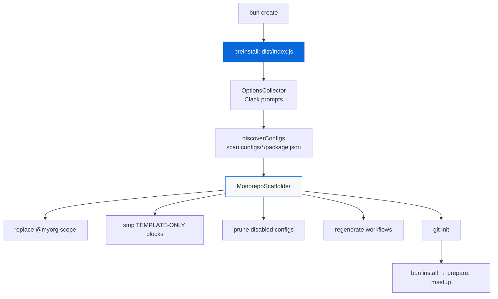

# @myorg/template

The scaffolder that turns this monorepo into a reusable `bun create` template — and the aggregator that regenerates every CI workflow.

> [!IMPORTANT]
> This package is **removed from generated projects** (`selfDestruct: true`). It is template-development-only.

## What it provides

- A `bun-create.preinstall` entry in the root manifest that runs the committed bundle at `dist/index.js`, so a project is scaffolded *before* `bun install` — only surviving packages get installed
- A **data-driven** engine: `discoverConfigs()` reads the `scaffold` metadata in each `configs/*/package.json`; no config is hardcoded in the scaffolder
- `mdocs` — one bin for `docs:sync` (regenerate workflows) and `site` (build the docs artifact)

## How a project is created



### Pipeline

1. `computeDisabledScopes` — from the collected config overrides
2. `sanitizePackageJson` — drop `bun-create`, devDeps, scripts, workspaces
3. `sanitizeTemplateRefs` — remove template-only references
4. `replaceScopePlaceholders` — `@myorg` → the chosen scope
5. `stripTemplateMarkers` — remove `TEMPLATE-ONLY` blocks
6. `removeTemplateFiles` — delete pruned configs and removals
7. `handleConfig` — self-destruct plus data-driven removals
8. `regenerateCI` — aggregate workflows from the survivors
9. `setupGitHooks` — `git init` when needed

## Scaffold metadata

Each config declares how it behaves when disabled:

```json
{
  "scaffold": {
    "default": true,
    "flag": "playwright",
    "prompt": "Include E2E testing?",
    "type": "confirm",
    "removals": {
      "false": {
        "extraRemovals": ["apps/example/e2e"],
        "filePatternsToRemove": ["**/e2e/**", "**/*.e2e.ts"],
        "fileRegexesToRemove": ["playwright"],
        "scriptsToRemove": ["test:e2e"],
        "turboTasksToRemove": ["test:e2e"],
        "appDepsToRemove": ["@myorg/playwright"]
      }
    }
  }
}
```

| Field | Type | What it removes |
| :--- | :--- | :--- |
| `extraRemovals` | exact paths | `rm -rf` |
| `filePatternsToRemove` | globs (`Bun.Glob`) | `**/e2e/**` and similar |
| `fileRegexesToRemove` | regexes | matched against relative paths |
| `scriptsToRemove` | script names | root `package.json` scripts |
| `turboTasksToRemove` | task names | `turbo.base.json` tasks |
| `appDepsToRemove` | dependency names | `apps/example` devDeps |

Configs with `"default": "always"` are kept — except `selfDestruct` ones, which are always removed.

## Workflow placeholders

`regenerateCI` splices step fragments into a skeleton, then interpolates values whose source of truth is TypeScript:

| Placeholder | Value |
| :--- | :--- |
| `{{STEPS}}` / `{{UPDATES}}` | the concatenated `configs/*/<fragment>` files |
| `{{BUN_VERSION}}` | Bun version installed by the workflow |
| `{{NATIVE_DIR}}` | `packages/native` |
| `{{NATIVE_CARGO}}` | `packages/native/Cargo.toml` |
| `{{NATIVE_NPM}}` | `packages/native/npm/*/package.json` |
| `{{NATIVE_WASI_SDK_VERSION}}` | WASI SDK release for the native workflow |
| `{{APP_DIR}}` | `apps/example` |
| `{{APP_DOCKERFILE}}` | `apps/example/Dockerfile` |

Fragments are plain YAML, so this is how `hashFiles('…')` guards stay in sync with the packages they point at. GitHub's own `${{ … }}` expressions are untouched.

## Source map

| File | Role |
| :--- | :--- |
| `src/index.ts` | CLI entry (bundled) |
| `src/collector.ts` | `OptionsCollector` — Clack prompts, root discovery |
| `src/scaffolder.ts` | `MonorepoScaffolder` — pipeline + glob/regex removal |
| `src/configs.ts` | `discoverConfigs` + `ScaffoldMeta` types |
| `src/harness.ts` | `TemplateHarness` — full-pipeline integration helper |
| `src/aggregate.ts` | `docs:sync` — aggregates workflows from `configs/*` |
| `src/docs.ts` | `mdocs` bin — `docs:sync` and `site` |

## Development

```bash
bun run test:template            # unit + integration + combination cases
bun run test:template:cases      # combination cases only
bun run --filter @myorg/template build   # rebuild the committed dist bundle
bun run docs:sync                # regenerate workflows
bun run docs:site                # build the docs artifact
bun run ci:lint                  # validate the regenerated workflows
```

<details>
<summary>Build and test notes</summary>

- Build: `mbun build ./src/index.ts --outdir ./dist --target bun --packages bundle --minify` → the committed `dist/index.js`.
- Tests: a unit suite per source file plus a full-pipeline integration suite in `tests/index.test.ts`.
- Only Bun-native APIs in the bundle (`Bun.file`, `Bun.write`, `Bun.$`, `Bun.Glob`); dependencies are bundled, so no runtime install is needed at create time.

</details>
