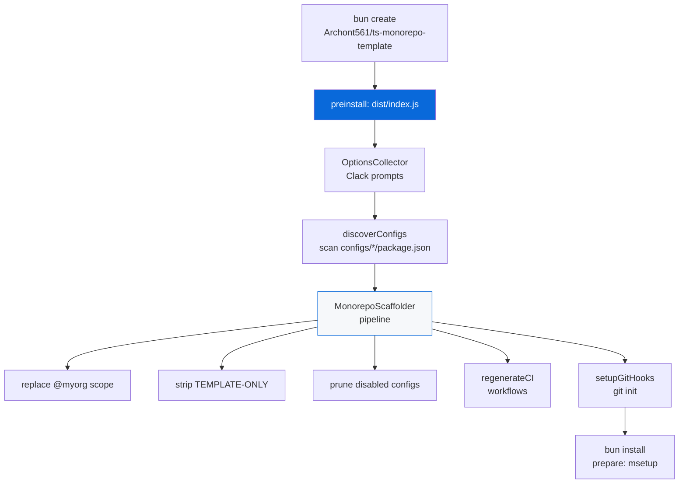

# @myorg/template

> The `bun create` scaffolder that turns this monorepo into a reusable template.

## What it provides

- `@myorg/template` — a first-class Bun workspace declared as `bun-create.preinstall` in the root `package.json`. On `bun create`, the committed bundle at `dist/index.js` scaffolds the project *before* `bun install`
- A **data-driven** engine: `discoverConfigs()` reads every `configs/*/package.json`'s `scaffold` metadata — no config package is hardcoded in the scaffolder
- `docs:sync` — runs `src/aggregate.ts` to regenerate `.github/workflows/*.yml` from the `configs/*` packages (`ci.steps.yml` and the gh-actions base skeletons). Root `README.md` and `AGENTS.md` are now static reference files with `TEMPLATE-ONLY` blocks for template vs monorepo descriptions

> [!IMPORTANT]
> This package is **removed** from generated projects (`selfDestruct: true`). Everything it references is stripped.

## Architecture



## Source map

| File | Role |
| :--- | :--- |
| `src/index.ts` | CLI entry (bundled) |
| `src/collector.ts` | `OptionsCollector` — Clack prompts + repo-root discovery |
| `src/scaffolder.ts` | `MonorepoScaffolder` — the pipeline engine |
| `src/configs.ts` | `discoverConfigs` / `ScaffoldMeta` types |
| `src/harness.ts` | `TemplateHarness` — full-pipeline integration helper (`BUN_CREATE_DIR`) |
| `src/aggregate.ts` | `docs:sync` — aggregates CI workflows from `configs/*` |
| `src/docs.ts` | `mdocs` bin — single bin for this package |

## Development

```bash
bun run --filter @myorg/template test     # unit + integration suites
bun run --filter @myorg/template build    # rebuild the committed dist bundle
bun run docs:sync                          # regenerate workflows (mdocs)
bun run ci:lint                            # after regenerating workflows
```

<details>
<summary>Build & test</summary>

- Build: `mbun build ./src/index.ts --outdir ./dist --target bun --packages bundle --minify`
- Produces committed `dist/index.js` bundle
- Regenerate with `bun run --filter @myorg/template build` whenever sources change
- Tests: unit suites per source file + full-pipeline integration in `tests/index.test.ts`
- Uses only Bun-native APIs (`Bun.file`, `Bun.write`, `Bun.$`) — no external runtime deps (bundled)

</details>

## Template Development Only

> [!CAUTION]
> This package is **removed** from generated projects (its scaffold metadata declares `selfDestruct: true`). Everything it references is stripped by the scaffolder (`TEMPLATE-ONLY` blocks, the `docs:sync` script, the `configs/template` workspace). Root `prepare` in generated projects uses `msetup` + `mchangeset init` directly.

- [ ] `bun run --filter @myorg/template build` after editing sources
- [ ] `bun run docs:sync` after editing workflow skeletons
- [ ] `bun run ci:lint` after regenerating workflows

See [AGENT.md](./AGENT.md) for the agent-facing reference.
