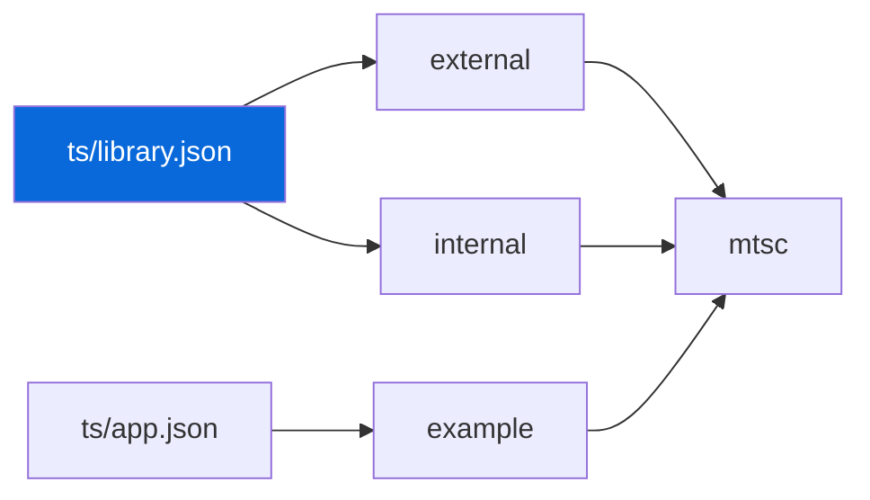

## TypeScript

> [!CAUTION]
> Never add `typescript`, `bunup`, or `@types/bun` to individual packages. Owned by `@myorg/ts` and hoisted.

- `@myorg/ts` (`configs/ts`) owns `typescript`, `@types/bun`, `bunup` — hoisted to root `node_modules`, no per-package devDeps
- Presets: `library.json` for `packages/*` (`rootDir:.`, `outDir:dist`, `types:[bun]`, `@src/*` + `@tests/*` paths), `app.json` for `apps/*` (`noEmit`, `types:[bun]`)
- `mtsc` bin wraps `tsc`; `bun run typecheck` → `mturbo typecheck` → per-package `mtsc --noEmit`
- No `baseUrl` in any `tsconfig.json` — removed in TS 7.0 (TS5102), use `paths` only
- `tsconfig.json` per package extends `@myorg/ts/library.json` or `app.json` with `rootDir`, `outDir`, `types`, `paths`

| Package | Extends | Build |
| :--- | :--- | :--- |
| `external` | `library.json` | `mbunup` |
| `internal` | `library.json` | `mbunup` |
| `example` | `app.json` | `bun --hot` (no bundle) |

> [!WARNING]
> `baseUrl` was removed in TS 7.0 — use `paths` with `@src/*`.
