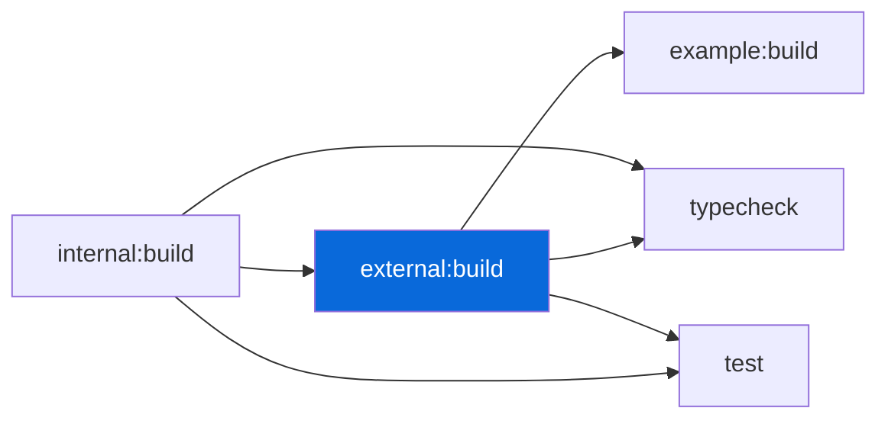

## Turbo

> [!NOTE]
> Task orchestration — no root `turbo.json`, only `turbo.base.json` in `configs/turbo`.

- `mturbo` (from `@myorg/turbo`) wraps `turbo` with `--root-turbo-json=<configs/turbo/turbo.base.json>`
- Root scripts (`dev`, `build`, `typecheck`, `test`, `coverage`) delegate to `mturbo` — Turbo infers inter-package dependency order (`^build`) and caches (`.turbo/`)
- Tasks: `build` (depends `^build`, outputs `dist/`), `typecheck` (depends `^build`), `test` (depends `^build`, outputs `coverage/`), `dev` (persistent, no cache), `coverage` (merges LCOV)
- No root `turbo.json` — only `configs/turbo/turbo.base.json` (exported as `@myorg/turbo/turbo.json`)

| Task | Deps | Cache |
| :--- | :--- | :---: |
| `build` | `^build` | ✅ |
| `typecheck` | `^build` | ✅ |
| `test` | `^build` | ✅ |
| `dev` | — | ❌ |
| `coverage` | `^build` | ✅ |

> [!TIP]
> `bun run dev` starts all packages in watch mode — persistent tasks.
