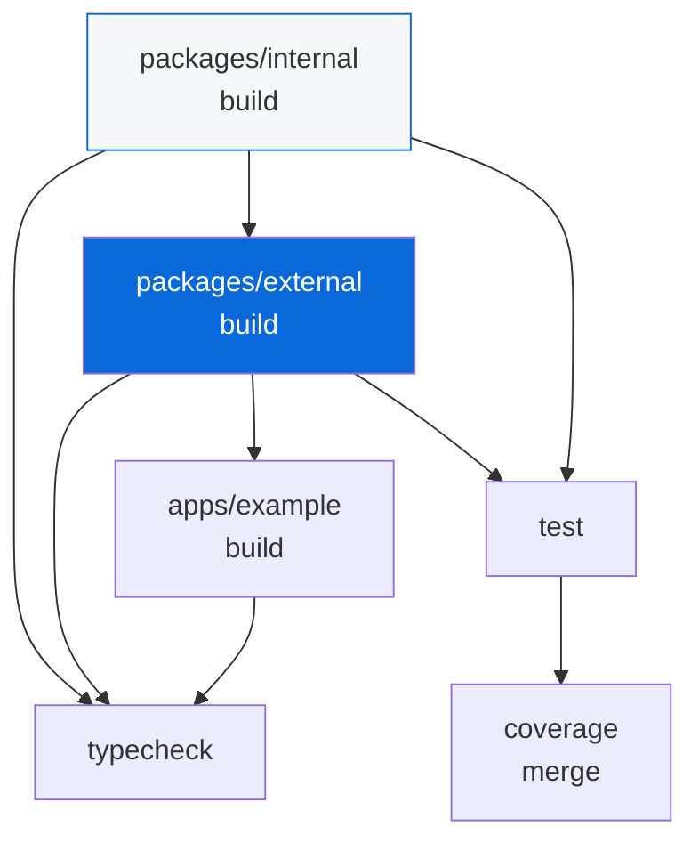

# @myorg/turbo

> Turborepo task orchestration, configured.

## What it provides

- `turbo` as a shared devDependency
- `turbo.base.json` — the root task graph (there is no root-level `turbo.json`)
- `mturbo` — a CLI alias that resolves Turbo and bakes in `--root-turbo-json=<configs/turbo/turbo.base.json>` automatically
- Every per-package job goes through Turbo: `build`, `dev`, `test`, `coverage`, `typecheck`. Packages implement their own method (`mbunup`, `mbun test`, `mnative napi:build`, `me2e`, `munocss build`) and the root scripts are just `mturbo <task>`

> [!NOTE]
> All root scripts delegate to `mturbo` — Turbo infers dependency order and caches output.

### Task graph

| Task | Depends on | Output | Cache |
| :--- | :--- | :--- | :---: |
| `build` | `^build` | `dist/` | ✅ |
| `typecheck` | `^build` | — | ✅ |
| `test` | `^build` | `coverage/` | ✅ |
| `dev` | — | — | ❌ (persistent) |
| `coverage` | `^build` | `coverage/lcov.info` | ✅ |

## Usage

```bash
bun run dev          # watch all packages
bun run build        # build in dependency order
bun run typecheck    # type-check all packages
bun run test         # run tests
```



<details>
<summary>Caching</summary>

- Turbo caches task outputs in `.turbo/`
- `dev` is persistent — never cached
- `build` outputs `dist/` — cached per package
- Cache key includes file hashes + dependency graph

</details>

## Files

- `turbo.base.json` (exported as `@myorg/turbo/turbo.json`)

See [AGENTS.md](./AGENTS.md) for the agent-facing reference.
