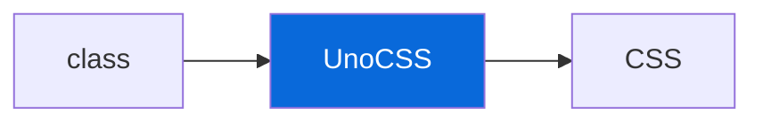

## UnoCSS

> [!NOTE]
> Opt-in atomic CSS — disabled by default, enabled via scaffold prompt.

- `@myorg/unocss` (`configs/unocss`) provides `unocss`, `uno.config.ts` with `presetUno`, `presetAttributify`, `presetIcons`
- Integration: `apps/example` imports UnoCSS CSS, `uno.config.ts` at root or app level
- Usage: class-based utilities (`flex`, `p-4`, `bg-blue-500`) — no CSS files, generated on demand
- No bin — UnoCSS runs via Vite plugin or CLI if configured; in this template it's used via `apps/example` setup

| File | Purpose |
| :--- | :--- |
| `uno.config.ts` | Shared config |
| `apps/example/src/styles` | CSS entry if enabled |

> [!TIP]
> After enabling, add `uno.css` import to `apps/example/src/index.ts` or layout.
