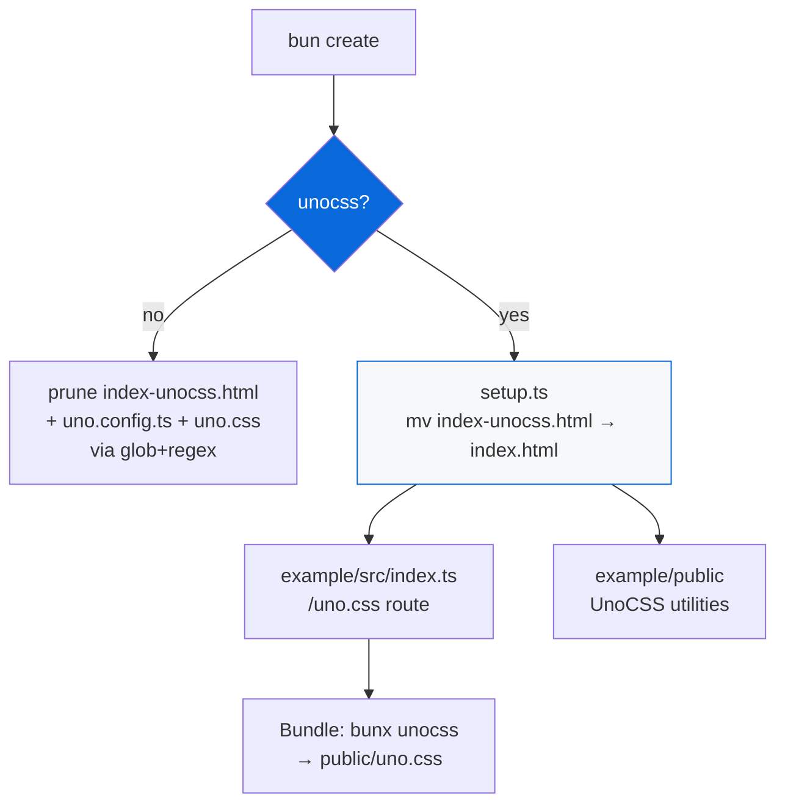

# @myorg/unocss

> Atomic CSS with UnoCSS, opt-in — with conditional example handling (index-unocss.html → index.html).

## What it provides

- `unocss` as shared devDependency
- `uno.config.ts` inside `configs/unocss/` (not root) — avoids root level file, used via `bunx unocss --config configs/unocss/uno.config.ts`
- `apps/example/public/index-unocss.html` — UnoCSS version of index.html with utility classes
- Setup script `src/setup.ts` that replaces `index.html` with UnoCSS version when enabled + ensures CLI uses `--config` flag
- Example bundle handling: `/uno.css` route in `apps/example/src/index.ts` + `build:css` script using `--config`

> [!NOTE]
> Opt-in — selected during scaffolding via `Include UnoCSS?` prompt. Disabled by default.

## Architecture



### Scaffold options

| Option | Description | Result |
| :--- | :--- | :--- |
| `false` | No UnoCSS (default) | Deletes `index-unocss.html`, `uno.config.ts`, `uno.css` via glob + regex + extraRemovals |
| `true` | Include UnoCSS | Keeps + runs `setup.ts` → `index-unocss.html` replaces `index.html`, adds deps |

### Data-driven removals

When `false`:

| Field | Patterns | Purpose |
| :--- | :--- | :--- |
| `extraRemovals` | `uno.config.ts`, `apps/example/public/index-unocss.html`, `index-plain.html`, `uno.css` | Exact paths |
| `filePatternsToRemove` | `uno.config.*`, `**/*.unocss.*`, `**/unocss/**`, `**/index-unocss.html`, `**/uno.css` | Glob via `Bun.Glob` |
| `fileRegexesToRemove` | `unocss`, `uno\.config`, `index-unocss` | Regex |
| `appDepsToRemove` | `@unocss/reset`, `unocss`, `@myorg/unocss` | Remove from example |

When `true`, `setup: configs/unocss/src/setup.ts` runs:
1. Ensures `uno.config.ts` exists (extends `@myorg/unocss` baseConfig)
2. Moves `index-unocss.html` → `index.html` (replaces plain with UnoCSS version)
3. Adds `@myorg/unocss` dep to example app
4. Ensures `/uno.css` route exists in example server

## Usage

```bash
bun create Archont561/ts-monorepo-template my-app   # choose UnoCSS
cd my-app

# Dev with UnoCSS
bun run dev              # serves index.html (now UnoCSS version) + /uno.css
bun run build:css        # generate public/uno.css via `bunx unocss`

# HTML uses utility classes:
# <div class="flex items-center p-4 bg-blue-500 text-white rounded">Hello UnoCSS</div>
```

<details>
<summary>Example files</summary>

```
apps/example/public/
  index.html              # plain (default) — when unocss disabled, this remains
  index-unocss.html       # UnoCSS version — when enabled, replaces index.html via setup.ts (mv)
  uno.css                 # generated CSS — deleted when disabled, served via /uno.css route when enabled

configs/unocss/
  uno.config.ts           # config — not root, used via --config flag, deleted when disabled via scaffold (whole dir removed)
  index.ts                # baseConfig with presets

# No root uno.config.ts — avoided via --config flag (per CLI -c option)
```

Bundle handling (no TEMPLATE-ONLY for unocss — via file deletion + runtime checks):
- `src/index.ts` has `/uno.css` route that returns generated CSS or fallback note — works even when unocss disabled
- `src/pages/index.ts` tries `index-unocss.html` first, then `index.html` — runtime file existence check
- `src/pages/api/index.ts` lists `/uno.css` when `uno.config.ts` exists — runtime check
- `public/uno.css` served via `/uno.css`, deleted when disabled via `filePatternsToRemove`

</details>

## Config highlights

| Preset | Description |
| :--- | :--- |
| `presetWind3` | Tailwind-compatible utilities (v3) |
| `transformerDirectives` | @apply etc |
| `transformerVariantGroup` | `hover:(bg-blue text-white)` |

```ts
// configs/unocss/uno.config.ts — no root file, use --config flag
import { baseConfig, defineConfig } from "./index.ts";
export default defineConfig({
  ...baseConfig,
  content: {
    filesystem: ["./apps/example/src/**/*.{html,js,ts,tsx}", "./apps/example/public/**/*.html"],
  },
  cli: {
    entry: [{ patterns: ["apps/example/src/**/*.{html,ts,tsx}", "apps/example/public/**/*.html"], outFile: "apps/example/public/uno.css" }],
  },
});
```

CLI usage (avoids root level file):
```bash
bunx unocss --config configs/unocss/uno.config.ts --out-file apps/example/public/uno.css
bun run build:css   # uses --config flag internally
```

See [AGENT.md](./AGENT.md) for agent reference.
