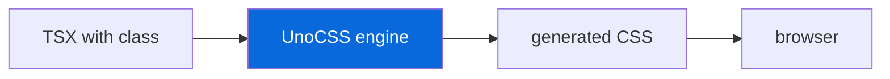

# @myorg/unocss

> Atomic CSS with UnoCSS, opt-in.

## What it provides

- `unocss` as shared devDependency
- `uno.config.ts` — shared config with presets
- Integration for `apps/example` (if selected)

> [!NOTE]
> Opt-in — selected during scaffolding via `Set up UnoCSS?` prompt. Disabled by default.

### Config highlights

| Preset | Description |
| :--- | :--- |
| `presetUno` | Tailwind-compatible utilities |
| `presetAttributify` | Attributify mode |
| `presetIcons` | Icon presets |

## Usage

```bash
# After enabling UnoCSS
bun run dev   # UnoCSS watches and generates CSS
```

```typescript
// uno.config.ts
import { defineConfig, presetUno } from "unocss";

export default defineConfig({
  presets: [presetUno()],
});
```



<details>
<summary>Example usage</summary>

```tsx
<div class="flex items-center p-4 bg-blue-500 text-white rounded">
  Hello UnoCSS
</div>
```

- No CSS files needed — utilities generated on demand
- Works with `apps/example` Bun.serve

</details>

See [AGENT.md](./AGENT.md) for the agent-facing reference.
