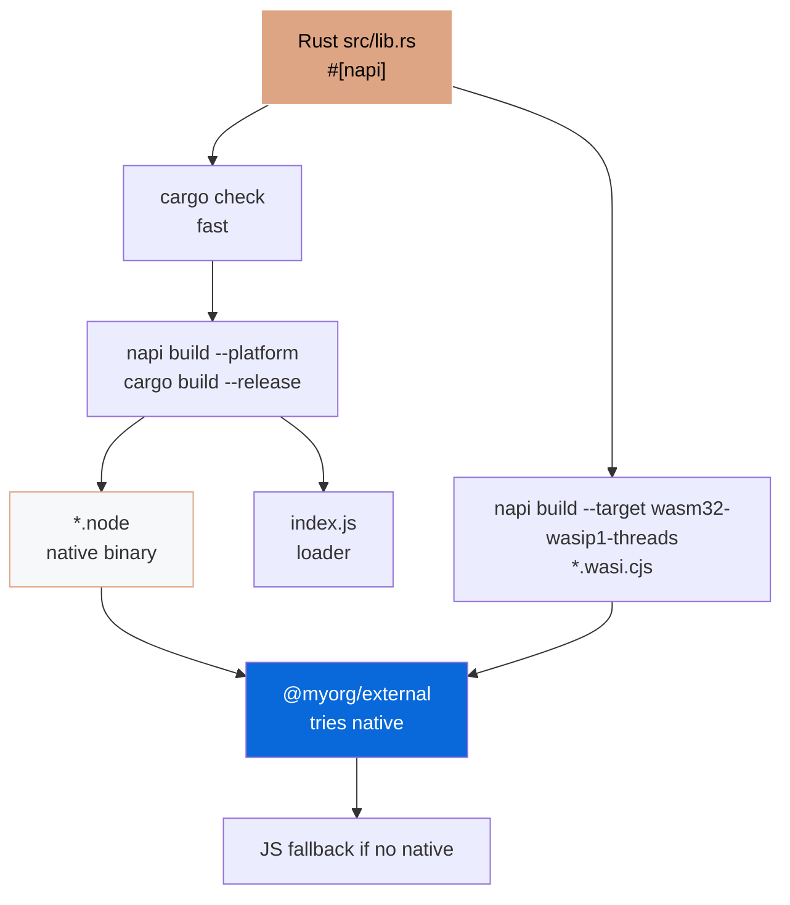

# @myorg/native

> Native Rust bindings via Cargo + napi-rs — with WASM fallback and platform-specific binaries.

## What it provides

- Rust crate (`Cargo.toml`, `cdylib`, `edition = "2021"`) with `#[napi]` macros, uses workspace dependencies (`workspace = true`)
- `add`, `fibonacci`, `reverse_string`, `Counter` class, `primes_up_to`, async `fetch_data_simulated`
- Cargo-first: `cargo check`, `cargo clippy -- -D warnings`, `cargo fmt`, `cargo test --workspace`, `cargo build --release` (lto, codegen-units=1, strip)
- napi-rs build: native `.node` + WASI `.wasi.cjs` fallback (built via `napi build` which uses cargo)
- Platform-specific npm packages via `napi create-npm-dirs` + `artifacts` + `pre-publish`
- Workspace root `Cargo.toml` with `resolver = "2"` and `workspace.dependencies`

> [!IMPORTANT]
> Opt-in — selected during `bun create Archont561/ts-monorepo-template` via `Set up native Node-API bindings?`

## Cargo Handling

### Workspace Structure

```
Cargo.toml (root)               # [workspace] members = ["packages/native"], resolver=2
rust-toolchain.toml             # stable + rustfmt, clippy, wasm32-wasip1-threads
packages/native/
  Cargo.toml                    # edition=2021, workspace=true deps, cdylib
  build.rs                      # napi_build::setup()
  src/lib.rs                    # #[napi] impl
```

Root `Cargo.toml`:

```toml
[workspace]
members = ["packages/native"]
resolver = "2"

[workspace.dependencies]
napi = { version = "3.0.0", features = ["napi4"] }
napi-derive = "3.0.0"
napi-build = "2"

[profile.release]
opt-level = 3
lto = true
codegen-units = 1
strip = "symbols"

[profile.dev]
opt-level = 0
debug = true

[profile.ci]
inherits = "dev"
opt-level = 1
```

Member `packages/native/Cargo.toml`:

```toml
[package]
name = "native"
edition = "2021"
[lib]
crate-type = ["cdylib"]
[dependencies]
napi = { workspace = true }
napi-derive = { workspace = true }
[build-dependencies]
napi-build = { workspace = true }
```

### Core Commands (Cargo-first)

```bash
# Fast inner loop — type-check only, no codegen
cargo check --workspace
cargo check -p native

# Lint & format
cargo clippy --workspace -- -D warnings   # deny warnings, CI
cargo fmt --all -- --check                # check
cargo fmt --all                           # write

# Test
cargo test --workspace
cargo test -p native
cargo test my_fn                          # filter
cargo nextest run --workspace             # faster parallel (install: cargo install cargo-nextest)

# Build
cargo build --workspace                   # debug
cargo build --workspace --release         # optimized (lto, strip)
cargo build --workspace --profile ci      # ci profile (opt-level=1)

# Deps
cargo tree
cargo tree -d                             # duplicates
cargo add serde --features derive         # add dep (requires cargo-edit)
cargo update -p serde

# Docs
cargo doc --no-deps --workspace
cargo doc --open
```

### Bun Scripts (wrapping cargo + napi)

```bash
# Native for current host (cargo check + napi build --platform)
bun run build:native
bun --filter @myorg/native run build

# Cargo wrappers
bun --filter @myorg/native run cargo:check
bun --filter @myorg/native run cargo:clippy
bun --filter @myorg/native run cargo:fmt:check
bun --filter @myorg/native run cargo:test
bun --filter @myorg/native run cargo:build:release

# Debug
bun --filter @myorg/native run build:debug

# WASM fallback (requires Rust WASI target)
rustup target add wasm32-wasip1-threads
bun run build:wasm
bun --filter @myorg/native run build:wasm
```

Output:

- `native.<platform>.node` (e.g. `native.darwin-arm64.node`)
- `index.js` — loader that picks correct `.node`
- `index.d.ts` — TypeScript types (generated)
- `native.wasi.cjs` + workers — WASM fallback

## Architecture



## Usage in Bun

```ts
import { add, fibonacci, Counter } from "@myorg/native";

console.log(add(1, 2)); // 3 — Rust speed
console.log(fibonacci(40)); // Fast

const counter = new Counter(0);
counter.increment(); // 1
```

With fallback (in `external`):

```ts
// packages/external/src/native.ts
let native: any = null;
try {
  native = await import("@myorg/native");
} catch {
  console.warn("Native not available, using JS fallback");
}

export function add(a: number, b: number) {
  return native ? native.add(a, b) : a + b;
}
```

> [!WARNING]
> Import addon only from server modules — browser bundle cannot load `.node`.

## WASM

> [!CAUTION]
> Bun + WASM has open incompatibility (napi-rs#2965). Test separately before shipping to Bun users.

```bash
rustup target add wasm32-wasip1-threads
bun run build:wasm
```

Generates `native.wasi.cjs` + browser/worker files.

Config in `package.json` `napi.wasm`:

```json
{
  "wasm": {
    "initialMemory": 16,
    "maximumMemory": 65536,
    "browser": { "fs": false, "asyncInit": true }
  }
}
```

## Platform Packages (Publish)

```bash
napi create-npm-dirs   # Create npm/ per-target dirs
# In CI per target:
napi build --release --target <target>
# Collect:
napi artifacts
# Publish:
napi pre-publish
npm publish --access public
```

Root `package.json` gets `optionalDependencies` for each platform.

> [!IMPORTANT]
> Use npm scope (`@myorg/native`) — required for per-target model.

## Cross-Compilation

- `--use-napi-cross`: Linux glibc on Linux x64/arm64
- `--cross-compile` (`-x`): Windows MSVC from non-Windows, musl
- `cargo-zigbuild` for easy cross-compilation via Zig linker

```bash
cargo install cargo-zigbuild
cargo zigbuild --target aarch64-unknown-linux-gnu --release
```

## CI Matrix

```yaml
- uses: dtolnay/rust-toolchain@stable
  with:
    components: clippy, rustfmt
    targets: wasm32-wasip1-threads
- uses: Swatinem/rust-cache@v2
- run: cargo fmt --all -- --check
- run: cargo clippy --workspace -- -D warnings
- run: cargo check --workspace
- run: cargo test --workspace
- run: cargo build --workspace --release
- run: bun run build:native

strategy:
  matrix:
    include:
      - host: ubuntu-latest
        target: x86_64-unknown-linux-gnu
        build: napi build --release --target x86_64-unknown-linux-gnu --use-napi-cross
      - host: macos-latest
        target: aarch64-apple-darwin
        build: napi build --release --target aarch64-apple-darwin
```

## Debugging

```bash
DEBUG="napi:*" napi build
NAPI_RS_ENFORCE_VERSION_CHECK=1 bun run build
cargo tree
cargo tree -d
```

Common missing binary causes:

- `--no-optional` omitted optional deps
- Lockfile generated on another platform
- Deployment copied only JS, discarded `.node`

## References

- [napi-rs](https://napi.rs)
- [Cargo Book](https://doc.rust-lang.org/cargo/)
- [PLAN.md](../../configs/native/PLAN.md)
- [Native AGENT](../../configs/native/AGENT.md)
