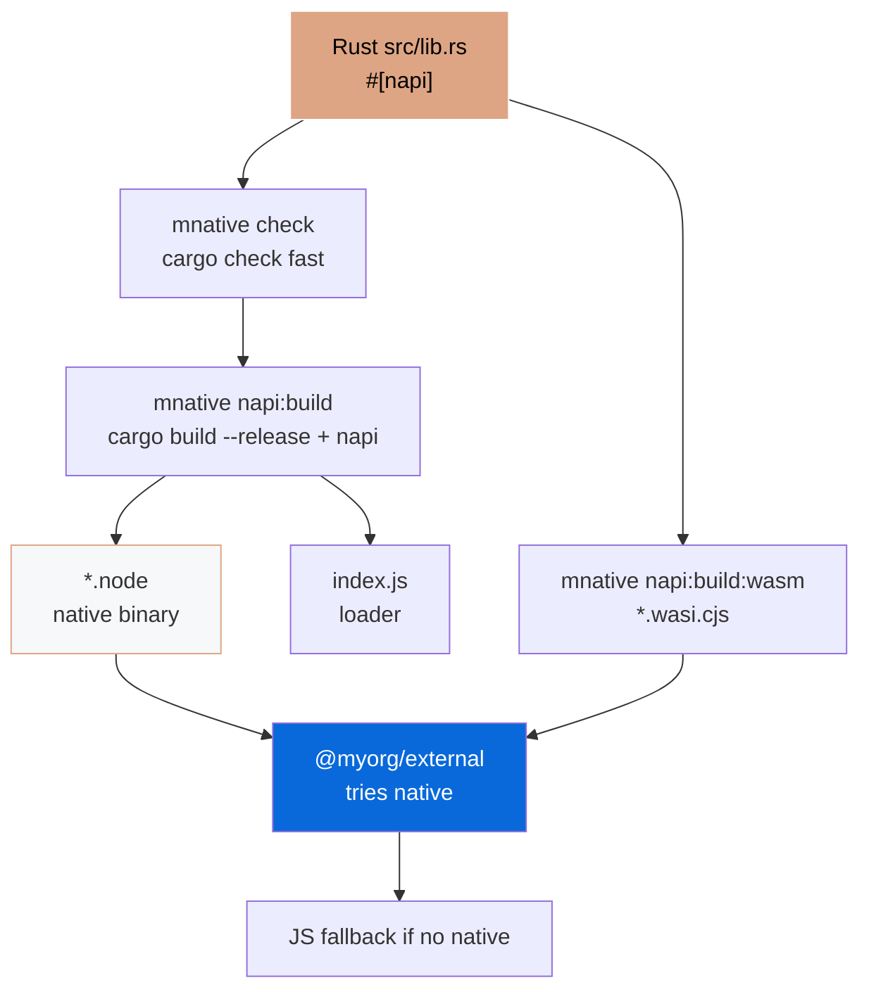

# @myorg/native

> Native Rust bindings via Cargo + napi-rs — self-contained `Cargo.toml`, no root workspace, with WASM fallback and platform-specific binaries. Built via `mnative` CLI.

## What it provides

- Rust crate (`Cargo.toml` self-contained, `cdylib`, `edition = "2021"`) with `#[napi]` macros, direct deps (no `workspace = true`)
- `add`, `fibonacci`, `reverse_string`, `Counter` class, `primes_up_to`
- Cargo via `mnative` CLI: `mnative check`, `mnative clippy -- -D warnings`, `mnative fmt`, `mnative test`, `mnative build --release` (lto, codegen-units=1, strip)
- napi-rs build: native `.node` + WASI `.wasi.cjs` fallback via `mnative napi:build`
- Platform-specific npm packages via `napi create-npm-dirs` + `artifacts` + `pre-publish`
- No root `Cargo.toml` — everything in `packages/native/Cargo.toml`

> [!IMPORTANT]
> Opt-in — selected during `bun create Archont561/ts-monorepo-template` via `Set up native Node-API bindings?`

## Cargo Handling — self-contained, no workspace

### Structure

```
packages/native/
  Cargo.toml                    # self-contained, edition=2021, direct deps, profiles, cdylib
  rust-toolchain.toml           # stable + rustfmt, clippy, wasm32-wasip1-threads (self-contained, no root file)
  .cargo/config.toml            # optional build config (self-contained)
  build.rs                      # napi_build::setup()
  src/lib.rs                    # #[napi] impl
```

`packages/native/Cargo.toml`:

```toml
[package]
name = "native"
edition = "2021"
[lib]
crate-type = ["cdylib"]
[dependencies]
napi = { version = "3.0.0", features = ["napi4"] }
napi-derive = "3.0.0"
[build-dependencies]
napi-build = "2"

[profile.release]
opt-level = 3
lto = true
codegen-units = 1
strip = "symbols"
```

No `[workspace]`, no `workspace = true` — simpler for JS monorepo.

### Core Commands via mnative CLI

```bash
# Fast inner loop — type-check only, no codegen
mnative check
cargo check --manifest-path packages/native/Cargo.toml

# Lint & format
mnative clippy                # cargo clippy -- -D warnings
mnative fmt:check             # cargo fmt --all -- --check
mnative fmt                   # cargo fmt --all

# Test
mnative test
cargo test --manifest-path packages/native/Cargo.toml

# Build
mnative build                 # cargo build
mnative build:release         # cargo build --release (lto, strip)
mnative build:ci              # cargo build --profile ci

# Deps
mnative tree
cargo tree --manifest-path packages/native/Cargo.toml
cargo tree -d

# Docs
mnative doc
```

### Bun Scripts (wrapping mnative + napi)

```bash
# Native for current host (cargo check + napi build --platform)
bun run build:native          # → bun --filter @myorg/native run build
mnative napi:build            # → cargo check && napi build --release --platform

# Cargo wrappers via mnative
bun run cargo:check           # → mnative check
bun run cargo:clippy          # → mnative clippy
bun run cargo:fmt:check       # → mnative fmt:check
bun run cargo:test            # → mnative test
bun run cargo:build:release   # → mnative build:release

# Via filter
bun --filter @myorg/native run cargo:check
bun --filter @myorg/native run build

# Debug
bun --filter @myorg/native run build:debug

# WASM fallback
rustup target add wasm32-wasip1-threads
bun run build:wasm            # → mnative napi:build:wasm
```

Output:

- `native.<platform>.node` (e.g. `native.darwin-arm64.node`)
- `index.js` — loader that picks correct `.node`
- `index.d.ts` — TypeScript types (generated)
- `native.wasi.cjs` + workers — WASM fallback

## Architecture



## Usage in Bun

```ts
import { add, fibonacci, Counter } from "@myorg/native";

console.log(add(1, 2)); // 3 — Rust speed
console.log(fibonacci(40)); // Fast

const counter = new Counter(0);
counter.increment(); // 1
```

With fallback (in `external`):

```ts
// packages/external/src/native.ts
let native: any = null;
try {
  native = await import("@myorg/native");
} catch {
  console.warn("Native not available, using JS fallback");
}

export function add(a: number, b: number) {
  return native ? native.add(a, b) : a + b;
}
```

> [!WARNING]
> Import addon only from server modules — browser bundle cannot load `.node`.

## WASM

> [!CAUTION]
> Bun + WASM has open incompatibility (napi-rs#2965). Test separately before shipping to Bun users.

```bash
rustup target add wasm32-wasip1-threads
bun run build:wasm
```

## Platform Packages (Publish)

```bash
napi create-npm-dirs   # Create npm/ per-target dirs
# In CI per target:
napi build --release --target <target>
# Collect:
napi artifacts
# Publish:
napi pre-publish
npm publish --access public
```

## Cross-Compilation

- `--use-napi-cross`: Linux glibc on Linux x64/arm64
- `--cross-compile` (`-x`): Windows MSVC from non-Windows, musl
- `cargo-zigbuild` for easy cross-compilation via Zig linker

```bash
cargo install cargo-zigbuild
cargo zigbuild --target aarch64-unknown-linux-gnu --release --manifest-path packages/native/Cargo.toml
```

## CI Matrix (no root Cargo.toml)

```yaml
- uses: dtolnay/rust-toolchain@stable
  with:
    components: clippy, rustfmt
    targets: wasm32-wasip1-threads
- uses: Swatinem/rust-cache@v2
  with:
    workspaces: "packages/native"
- run: mnative fmt:check
- run: mnative clippy
- run: mnative check
- run: mnative test
- run: mnative build:release
- run: bun run build:native

strategy:
  matrix:
    include:
      - host: ubuntu-latest
        target: x86_64-unknown-linux-gnu
        build: napi build --release --target x86_64-unknown-linux-gnu --use-napi-cross
      - host: macos-latest
        target: aarch64-apple-darwin
        build: napi build --release --target aarch64-apple-darwin
```

## References

- [napi-rs](https://napi.rs)
- [Cargo Book](https://doc.rust-lang.org/cargo/)
- [PLAN.md](../../configs/native/PLAN.md)
- [Native AGENT](../../configs/native/AGENT.md)
