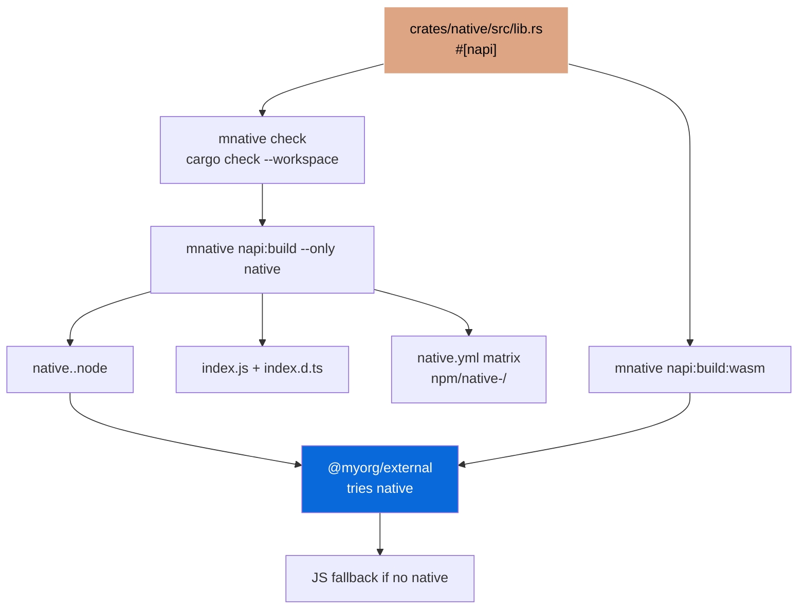

# @myorg/native

[](https://github.com/Archont561/ts-monorepo-template/actions/workflows/ci.yml)
[](https://www.rust-lang.org/)
[](../../../LICENSE.md)
[](https://bun.sh)

> Rust bindings via Cargo + napi-rs — the npm package built from the `native` crate, with a WASM fallback and platform-specific binaries.

> [!TIP]
> Badges: update `Archont561/ts-monorepo-template` → `YOUR_ORG/YOUR_REPO` after scaffolding.

## What it provides

- A thin `cdylib` crate (`../../crates/native`) whose `#[napi]` exports — `add`, `fibonacci`, `reverse_string`, `Counter`, `primes_up_to` — delegate to the pure Rust crate `../../crates/shared`
- Cargo over the whole workspace via `mnative`: `check`, `clippy` (`-D warnings`), `fmt:check`, `test`, `build:release` (lto, strip)
- napi-rs build for this package: `mnative napi:build --only native` → `native.<platform>.node`, loader and types
- WASM fallback: `mnative napi:build:wasm --only native`
- Per-platform npm packages generated in CI by `create-npm-dirs` + `artifacts`

> [!IMPORTANT]
> Opt-in — chosen during `bun create` via *Set up native Node-API bindings?*.

## Where it sits

```
packages/native/
  Cargo.toml              # virtual workspace: resolver 3, members = crates/*
  rust-toolchain.toml     # stable + rustfmt, clippy, wasm32-wasip1-threads
  .cargo/config.toml
  crates/
    package.json          # @myorg/native-crates — one Turbo package for all pure crates
    native/               # this package's crate — crate-type = ["cdylib"]
      Cargo.toml          # shared.workspace = true
      build.rs            # napi_build::setup()
      src/lib.rs          # #[napi] wrappers → shared::*
    shared/               # pure Rust — the logic, tested with plain cargo test
  npm/native/             # ← this package
```

There is no root `Cargo.toml`. Adding another binding is `mnative add <name>`, which creates `crates/<name>` + `npm/<name>` and syncs `members`.

The `@myorg/native-crates` devDependency is not a JS dependency — it mirrors the
crate's Cargo path dep on `shared` so Turbo orders pure Rust builds and tests
before this package's napi build (`mnative sync` keeps the edge in step). The
napi build itself is Turbo-cached: its inputs cover `../../crates/**` and the
workspace manifests, so every Rust change invalidates the cache.

## Commands

```bash
mnative check              # cargo check --workspace — the fast inner loop
mnative clippy             # clippy --workspace --all-targets -- -D warnings
mnative fmt:check
mnative test               # cargo test --workspace
mnative build:release      # lto, codegen-units=1, strip
mnative tree | doc | audit
```

This package's own scripts build only its crate:

```bash
bun run build          # mnative napi:build --only native
bun run build:wasm     # mnative napi:build:wasm --only native
bun run test           # mbun test
```

Root scripts cover every package: `bun run build:native`, `bun run build:wasm`, `bun run test:native`.

Output, generated next to this README and gitignored:

- `native.<platform>.node` (for example `native.darwin-arm64.node`)
- `index.js` — loader that picks the right binary
- `index.d.ts` — generated TypeScript types
- `*.wasm` + worker — WASM fallback

## Usage

```ts
import { add, fibonacci, Counter } from "@myorg/native";

console.log(add(1, 2)); // 3 — Rust speed
console.log(fibonacci(40)); // fast

const counter = new Counter(0);
counter.increment(); // 1
```

Through the fallback in `@myorg/external`:

```ts
const native = await import("@myorg/native").catch(() => null);

export function add(a: number, b: number) {
  return native ? native.add(a, b) : a + b;
}
```

> [!WARNING]
> Import the addon only from server modules — a browser bundle cannot load `.node`.



## WASM

> [!CAUTION]
> Bun + WASM has an open incompatibility (napi-rs#2965). Test separately before shipping to Bun users.

```bash
rustup target add wasm32-wasip1-threads
bun run build:wasm
```

## References

- [configs/native](../../../configs/native/README.md) — the config that owns this layout and the CI matrix
- [napi-rs](https://napi.rs)
- [Cargo Book — workspaces](https://doc.rust-lang.org/cargo/reference/workspaces.html)
