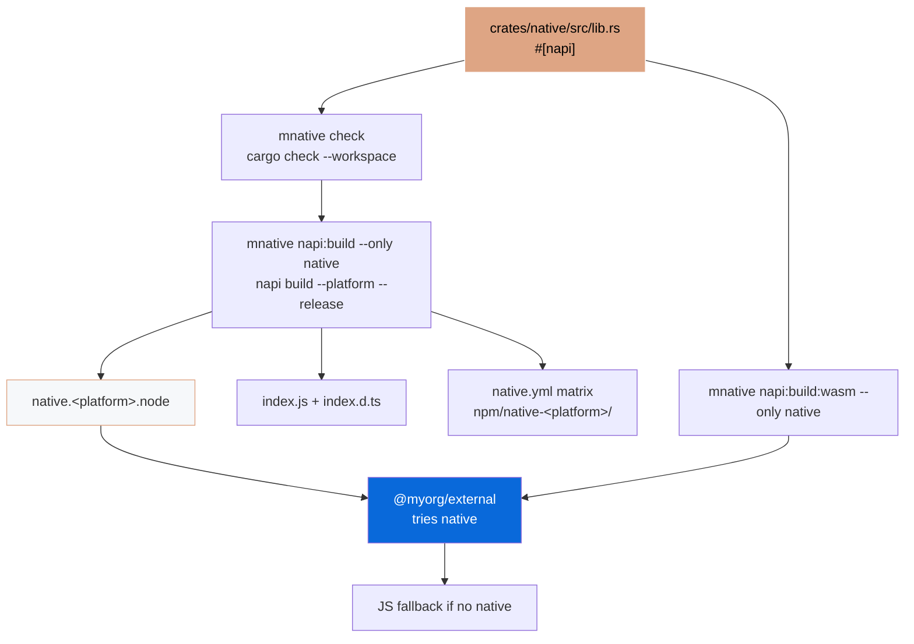

# @myorg/native

[](https://github.com/Archont561/ts-monorepo-template/actions/workflows/ci.yml)
[](https://codecov.io/gh/Archont561/ts-monorepo-template)
[](https://www.rust-lang.org/)
[](../../../LICENSE.md)
[](https://bun.sh)

> Native Rust bindings via Cargo + napi-rs — the npm package built from the `native` crate in the `packages/native` workspace, with a WASM fallback and platform-specific binaries. Built via `mnative`.

> [!TIP]
> Badges: update `Archont561/ts-monorepo-template` → `YOUR_ORG/YOUR_REPO` after scaffolding. Coverage includes Rust via `mnative llvm-cov` → `coverage/rust-lcov.info` merged into `coverage/lcov.info`.

## What it provides

- A `cdylib` crate (`../crates/native`) with `#[napi]` macros — `add`, `fibonacci`, `reverse_string`, `Counter`, `primes_up_to`
- Cargo via `mnative`: `mnative check`, `mnative clippy` (`-D warnings`), `mnative fmt:check`, `mnative test`, `mnative build:release` (lto, strip) — all over the whole workspace
- napi-rs build for this package: `mnative napi:build --only native` → `native.<platform>.node` + generated loader and types
- WASM fallback: `mnative napi:build:wasm --only native`
- Per-platform npm packages generated by `mnative create-npm-dirs` + `mnative artifacts` in CI

> [!IMPORTANT]
> Opt-in — selected during `bun create Archont561/ts-monorepo-template` via `Set up native Node-API bindings?`.

## Cargo — a crate inside the packages/native workspace

```
packages/native/
  Cargo.toml              # virtual workspace: resolver 3, members = crates/*
  rust-toolchain.toml     # stable + rustfmt, clippy, wasm32-wasip1-threads
  .cargo/config.toml
  crates/native/
    Cargo.toml            # this package's crate — crate-type = ["cdylib"]
    build.rs              # napi_build::setup()
    src/lib.rs            # #[napi] impl
  npm/native/             # ← this package
```

The crate manifest inherits everything shared from the workspace:

```toml
[package]
name    = "native"
version.workspace    = true
edition.workspace    = true
license.workspace    = true
repository.workspace = true

[lib]
crate-type = ["cdylib"]

[dependencies]
napi.workspace        = true
napi-derive.workspace = true

[build-dependencies]
napi-build.workspace = true

[lints]
workspace = true          # unsafe_code = "forbid", clippy.all
```

No root `Cargo.toml` — the workspace root is `packages/native/Cargo.toml`. Adding another binding is `mnative add <name>`: it creates `crates/<name>` + `npm/<name>` and syncs `members`.

## Commands

```bash
# Fast inner loop — type-check only, no codegen
mnative check                                   # cargo check --workspace
cargo check --manifest-path ../Cargo.toml

# Lint & format
mnative clippy                                  # clippy --workspace --all-targets -- -D warnings
mnative fmt:check
mnative fmt

# Test
mnative test                                    # cargo test --workspace

# Build
mnative build
mnative build:release                           # lto, codegen-units=1, strip
mnative build:ci

# Deps & docs
mnative tree
mnative doc
```

This package's own scripts build only its crate:

```bash
bun run build                   # → mnative napi:build --only native
bun run build:wasm              # → mnative napi:build:wasm --only native
bun --filter @myorg/native run build
```

Root scripts work too:

```bash
bun run build:native            # → mnative napi:build (every package)
bun run build:wasm              # → mnative napi:build:wasm
bun run test:native             # → mnative test
```

Output (gitignored, generated next to this README):

- `native.<platform>.node` (e.g. `native.darwin-arm64.node`)
- `index.js` — loader that picks the right binary
- `index.d.ts` — generated TypeScript types
- `*.wasm` + worker — WASM fallback

## Architecture



## Usage in Bun

```ts
import { add, fibonacci, Counter } from "@myorg/native";

console.log(add(1, 2)); // 3 — Rust speed
console.log(fibonacci(40)); // Fast

const counter = new Counter(0);
counter.increment(); // 1
```

With fallback (in `external`):

```ts
// packages/external/src/native.ts
const native = await import("@myorg/native").catch(() => null);

export function add(a: number, b: number) {
  return native ? native.add(a, b) : a + b;
}
```

> [!WARNING]
> Import the addon only from server modules — a browser bundle cannot load `.node`.

## WASM

> [!CAUTION]
> Bun + WASM has an open incompatibility (napi-rs#2965). Test separately before shipping to Bun users.

```bash
rustup target add wasm32-wasip1-threads
bun run build:wasm
```

## Platform Packages (Publish)

Generated in CI, never committed:

```bash
mnative create-npm-dirs                             # npm/native-<platform>/
mnative artifacts --dir packages/native/npm/.artifacts
# then, per platform package:
napi pre-publish
npm publish --access public
```

## Cross-Compilation

- `--use-napi-cross`: Linux glibc/musl from a Linux host (`mnative napi:build --target <triple> --cross`)
- `--cross-compile` (`-x`): Windows MSVC from non-Windows
- `cargo-zigbuild` for cross-compilation via the Zig linker

```bash
cargo install cargo-zigbuild
cargo zigbuild --target aarch64-unknown-linux-gnu --release --manifest-path ../Cargo.toml
```

## References

- [configs/native README](../../../configs/native/README.md)
- [napi-rs](https://napi.rs)
- [Cargo Book — workspaces](https://doc.rust-lang.org/cargo/reference/workspaces.html)
